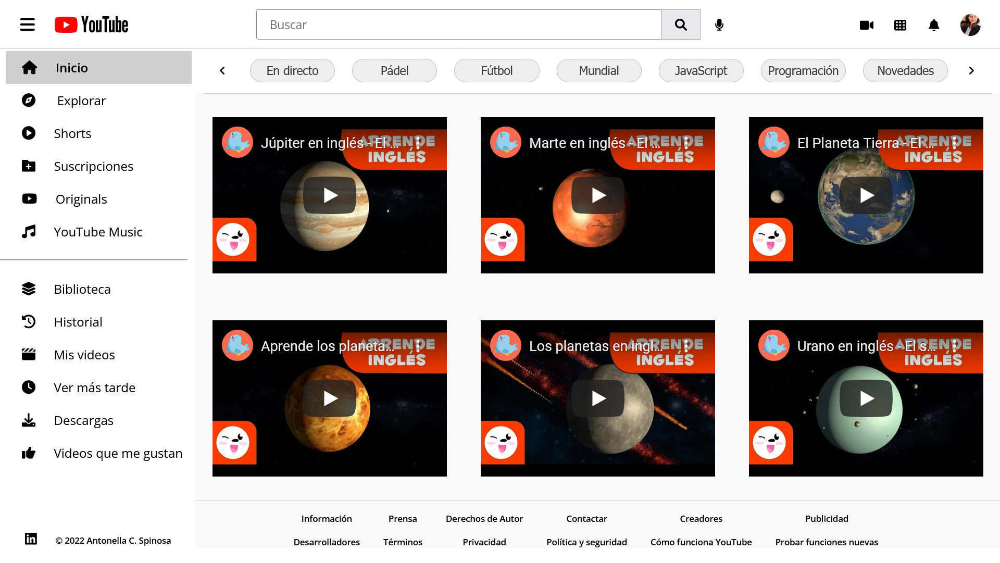

# Bootcamp Tzuzul Code - Creando Youtube - Reto #2

Esta es una solución al [Proyecto #2 - Bootcamp Tzuzul Code - Especialidad "Front End Fundamentals"](https://www.tzuzulcode.com/).

## Tabla de contenidos

- [Resumen](#Resumen)
  - [Captura de Pantalla](#Captura-de-pantalla)
- [Proceso](#Proceso)
  - [Construcción](#Construcción)
  - [Lo que aprendí](#Lo-que-aprendí)
- [Autora](#Autora)

## Resumen

El proyecto consiste en la elaboración de la interfaz gráfica del sitio web "YouTube".

Se debe destacar que su creación se realizó con los fines de practicar los recursos aprendidos en HTML y CSS y, que el mismo, no tiene funcionalidad para realizar búsquedas ni tampoco es adaptable a pantallas como celulares o tablet (no se empleó el uso de responsive)

Se utilizó el lenguaje de JavaScript para añadir funcionalidad a algunos botones.

### Captura de Pantalla

## Proceso

### Construido con:

- Estructura semántica en HTML5
- Diseñado en CSS:
  - Display: Flex y Grid
  - Overflow: Hidden
  - Position: Absolute, Fixed y Relative
  - Hover
  - Transition: Scale
  - z-index
  - Selectores simples: ID, Class, Element-Class, Element, Element-Element y \*
- JavaScript

### Lo que aprendí

Usé esta sección para practicar:

- El uso de las principales etiquetas en HTML;
- Display:Flex y Grid;
- Transiciones;
- Implementación de z-index;
- Fijar elementos;
- JavaScript.

## Autora

- LinkedIn - [Antonella Nicole Canalis Spinosa](https://www.linkedin.com/in/antonella-nicole-canalis-spinosa-/)
- Twitter - [@AntoSpinosa\_](https://twitter.com/AntoSpinosa_)
